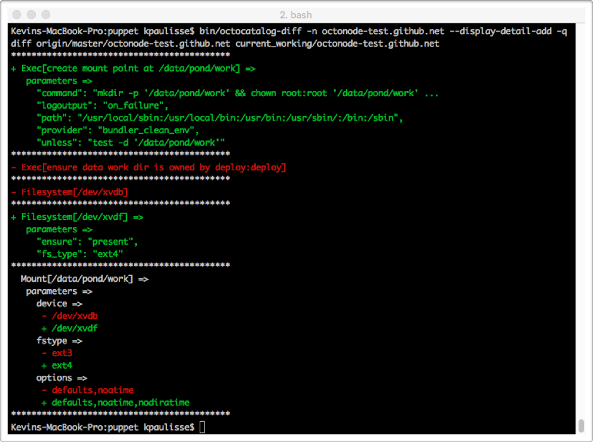

# octocatalog-diff

#### Compile Puppet catalogs from 2 branches, versions, etc., and compare them 

`octocatalog-diff` is a tool that enables developers to be more efficient when testing changes to Puppet manifests. It is most commonly used to display differences in Puppet catalogs between stable and development branches. It does not require a working Puppet master (or puppetserver), so it is often run by developers on their workstations and in Continuous Integration environments.

At GitHub, we manage thousands of nodes with a Puppet code base containing 500,000+ lines of code from over 200 contributors. We run `octocatalog-diff` thousands of times per day as part of Continuous Integration testing, and developers run it on their workstations as they are working with the code.

`octocatalog-diff` is written in Ruby and is distributed as a gem. It runs on Mac OS and Unix/Linux platforms.

We consider the 1.x release of `octocatalog-diff` to be stable and production-quality. We continue to maintain and enhance `octocatalog-diff` to meet GitHub's internal needs and to incorporate suggestions from the community. Please consult the [change log](/doc/CHANGELOG.md) for details.

If you've been using version 0.6.1 or earlier, please read about [What's new in octocatalog-diff 1.0](/doc/versions/v1.md) for a summary of new capabilities and breaking changes.

## How?

Traditional Puppet development generally takes one of two forms. Frequently, developers will test changes by running a Puppet agent (perhaps in `--noop` mode) to see if the desired change has resulted on an actual system. Others will use formal testing methodologies, such as `rspec-puppet` or the beaker framework to validate Puppet code.

`octocatalog-diff` uses a different pattern. In its most common invocation, it compiles Puppet catalogs for both the stable branch (e.g. master) and the development branch, and then compares them. It filters out attributes or resources that have no effect on ultimate state of the target system (e.g. tags) and displays the remaining differences. Using this strategy, one can get feedback on changes without deploying Puppet code to a server and conducting a full Puppet run, and this tool works even if test coverage is incomplete.

There are some [limitations](doc/limitations.md) to a catalog-based approach, meaning it will never completely replace unit, integration, or deployment testing. However, it does provide substantial time savings in both the development and testing cycle. In this repository, we provide example scripts for using `octocatalog-diff` in development and CI environments.

`octocatalog-diff` is currently able to get catalogs by the following methods:
- Compile catalog via the command line with a Puppet agent on your machine (as GitHub uses the tool internally)
- Obtain catalog over the network from PuppetDB
- Obtain catalog over the network using the API to query a Puppet Master / PuppetServer (Puppet 3.x and 4.x supported)
- Read catalog from a JSON file

## Example

Here is simulated output from running `octocatalog-diff` to compare the Puppet catalog changes between the master branch and the Puppet code in the current working directory:

The example above reflects the changes in the Puppet catalog from switching an underlying device for a mounted file system.

## Documentation

### Installation and use in a development environment

- [Installation](/doc/installation.md)
- [Configuration](/doc/configuration.md)
- [Basic command line usage](/doc/basic.md)
- [Advanced command line usage](/doc/advanced.md)
- [Troubleshooting](/doc/troubleshooting.md)

### Installation and use for CI

- [Setting up octocatalog-diff in CI](/doc/advanced-ci.md)

### Technical details

- [Requirements](/doc/requirements.md)
- [Limitations](/doc/limitations.md)
- [List of all command line options](/doc/optionsref.md)

### Project

- [Roadmap](/doc/roadmap.md)
- [Similar tools](/doc/similar.md)
- [Contributing](/.github/CONTRIBUTING.md)
- [Developer documentation](/doc/dev)
- [API documentation](/doc/dev/api.md)

## What's in a name?

During its original development at GitHub, this tool was simply called `catalog-diff`. However, there is already a [Puppet module with that name](https://forge.puppet.com/zack/catalog_diff) and we didn't want to create any confusion (in fact, a case could be made to use both approaches). So, we named the tool `octocatalog-diff` because who doesn't like the [octocat](https://octodex.github.com/)? Then one day in chat, someone referred to the tool as ":octocat:alog-diff", and that moniker caught on for electronic communication.

## Contributing

Please see our [contributing document](/.github/CONTRIBUTING.md) if you would like to participate!

## Getting help

If you have a problem or suggestion, please [open an issue](https://github.com/github/octocatalog-diff/issues/new) in this repository, and we will do our best to help. Please note that this project adheres to the [Open Code of Conduct](http://todogroup.org/opencodeofconduct/#GitHub%20Octocatalog-Diff/opensource@github.com).

## License

`octocatalog-diff` is licensed under the [MIT license](LICENSE).

It requires 3rd party ruby gems found [here](/vendor/cache). It also includes portions of other open source projects [here](/lib/octocatalog-diff/external/pson), [here](/spec/octocatalog-diff/fixtures/repos/default/modules/stdlib), [here](/spec/octocatalog-diff/support/httparty) and [here](/spec/octocatalog-diff/tests/external/pson). All 3rd party code and required gems are licensed either as MIT or Apache 2.0.

## Authors

`octocatalog-diff` was designed and authored by [Kevin Paulisse](https://github.com/kpaulisse) and is now maintained, reviewed, and tested by Kevin and the rest of the Site Reliability Engineering team at GitHub.
